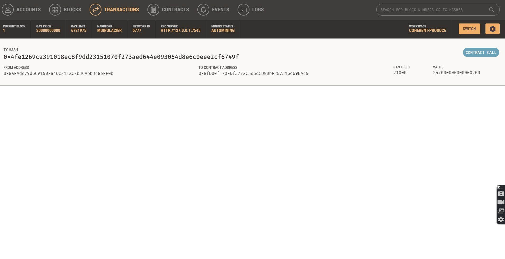

# Challenge_19_-CryptoCurrency_Payment_Application
The objective of this challenge is to complete the code that enables customers to send cryptocurrency payments to prospective freelance fintech professionals.

---
## Technologies
The programming language used for this analysis was **Python (v 3.9.7)**.

The applicable software needed to run this analysis are:

` 1. streamlit 2. dataclass 3. typing 4. web3 5. Web3.HTTPProvider (for Gananche connectivity) 5. os 8. mnemonic 9. requests 10. dotenv 11. bip44 `

---
## Contribution 
James Handral

James.Handral@gmail.com

---
## License

N/A

---

## Challenge Summary 
1. Import Ethereum Tranaction Function into the Fintech Finder Application.
2. Sign and Execute a Payment Transaction. 
3. Inspect the Transaction on Ganache.

---

## Screenshots of Steps:

### A - Screenshot of the Fintech Finder Website after Payment with a Hashmark Confirmation, showing prove of payment.

### B - Screenshot of the Ganache Website after payment and a reduction in the original account balance of 100 Ether to 99.75.

### C - Screenshot of the Transaction detail on the Ganache Website for the payment made.

### D - Screenshot of the Fintech Finder Website showing the new Ether balance of 99.75.

---

**link to .py files**

[fintech_finder](./Starter_Code%20(17)/Starter_Code/fintech_finder.py)

[crypto_wallet](./Starter_Code%20(17)/Starter_Code/crypto_wallet.py)